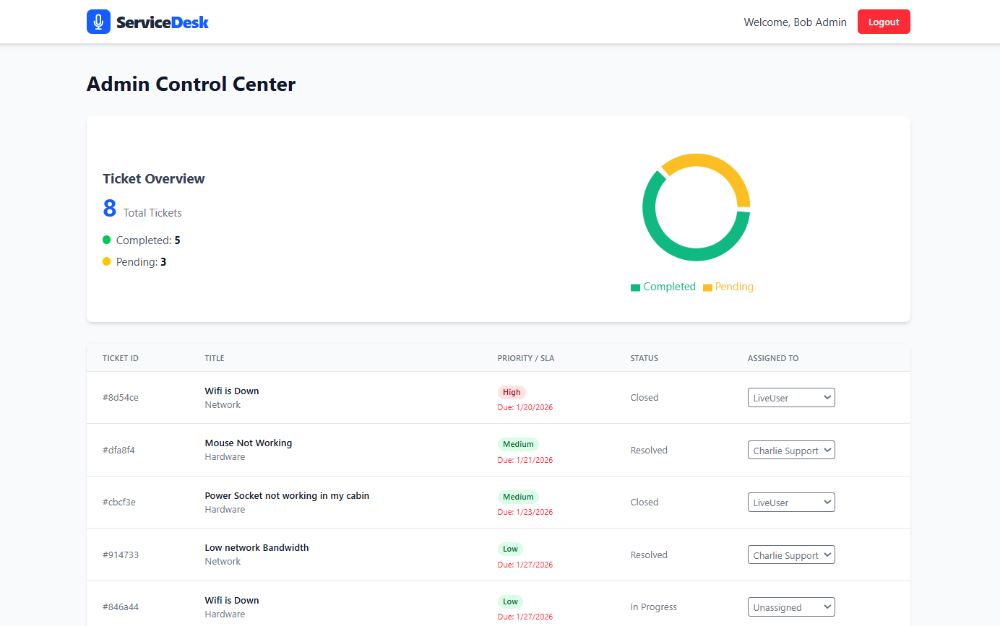

Markdown
# ServiceDesk | Enterprise IT Service Management


<div align="center">


A role-based IT service request and complaint management system designed to streamline internal support workflows, enforce SLAs, and improve accountability.

[Live Demo](#-live-demo) • [Features](#-key-features) • [Tech Stack](#-tech-stack) • [Installation](#-installation)

</div>

---

## 🖼️ Project Preview

| Admin Dashboard | Support Dashboard |
|:--:|:--:|
|  |  |

---

## 💡 About the Project

**ServiceDesk** replaces unstructured email or chat-based support with a structured, auditable ticketing system.

It is designed for **internal enterprise environments** where tracking responsibility, response time, and resolution quality is critical.

### What Problems It Solves
- Lost or ignored support requests  
- No visibility into ticket ownership  
- Missed SLA deadlines  
- Lack of accountability and reporting  

---

## 🔥 Key Features

### 🔐 Role-Based Access Control (RBAC)

The system provides distinct access and dashboards for each role:

- **User:** Raise service requests, track status, and confirm resolution  
- **Support Engineer:** Work on assigned tickets and update progress  
- **Administrator:** Assign tickets, manage users, and monitor system health  

---

### ⏱️ Automated SLA Management

Each ticket is assigned a resolution deadline based on priority:

- **High Priority:** 4 hours  
- **Medium Priority:** 24 hours  
- **Low Priority:** 3 days  

SLA deadlines are calculated automatically and monitored by the system.

---

### 🔄 Controlled Ticket Lifecycle

Tickets follow a strict workflow to ensure quality and traceability:

```
Open → In Progress → Resolved → Closed
```

- Invalid transitions are blocked at the backend  
- Tickets can only be **closed after user confirmation**, ensuring resolution quality  

---

### 📊 Admin Analytics & Audit Trail

- Real-time overview of open, resolved, and pending tickets  
- Complete audit log of ticket creation, assignment, and resolution actions  

---

## 🛠️ Tech Stack

**Frontend**
- React (Vite)  
- Tailwind CSS  

**Backend**
- Node.js  
- Express.js  

**Database**
- MongoDB Atlas  

**Authentication**
- JWT  
- Bcrypt  

**Deployment**
- Vercel (Frontend)  
- Render (Backend)  

---

## 🚀 Live Demo

- **Frontend:** https://complaint-service-management-system.vercel.app  
- **Backend:** https://complaint-backend-cafm.onrender.com  

> Backend is hosted on a free tier. Initial requests may take 30–60 seconds to respond.

---

## ⚙️ Installation

### Prerequisites
- Node.js (v16 or higher)  
- MongoDB (Local or Atlas)  

### Setup Backend

```bash
cd backend
npm install
```

Create a `.env` file in the backend directory:

```env
MONGO_URI=your_mongodb_connection_string
JWT_SECRET=your_jwt_secret_key
PORT=5000
```

> ⚠️ **Security Note:** Never commit `.env` files to GitHub. Use strong, unique values for `JWT_SECRET`.

Start the server:

```bash
npm start
```

### Setup Frontend

```bash
cd frontend
npm install
npm run dev
```

The app will run on `http://localhost:5173`  

---

## 🧪 Testing the Workflow (Reviewer Guide)

1. Register a user (default role: User)  
2. Promote one user to **Admin**  
3. Register another user and assign **Support** role  
4. User raises a high-priority ticket  
5. Admin assigns ticket to Support  
6. Support resolves the ticket  
7. User confirms resolution  
8. Admin views analytics dashboard  

---

## 🎯 Why This Project Matters

This project demonstrates:

- Real-world enterprise workflow design  
- Role-based authorization  
- SLA-driven backend logic  
- Full-stack system integration  
- Clean, maintainable architecture  

---

## 👨‍💻 Author

**Gagan Reddy A S**  
Final Year B.Tech – Information Technology  
Full Stack Developer  

---

## 📄 License

MIT License
